# ProtoVerse PC App

**Plug in a board. It appears, already working, with its lab manual attached.**

A Windows desktop app (WPF, .NET 8) that talks to a ProtoCore over USB serial
and turns whatever ProtoMods are plugged into it into live control panels —
no serial terminal, no hand-decoding hex, no code required to use it.

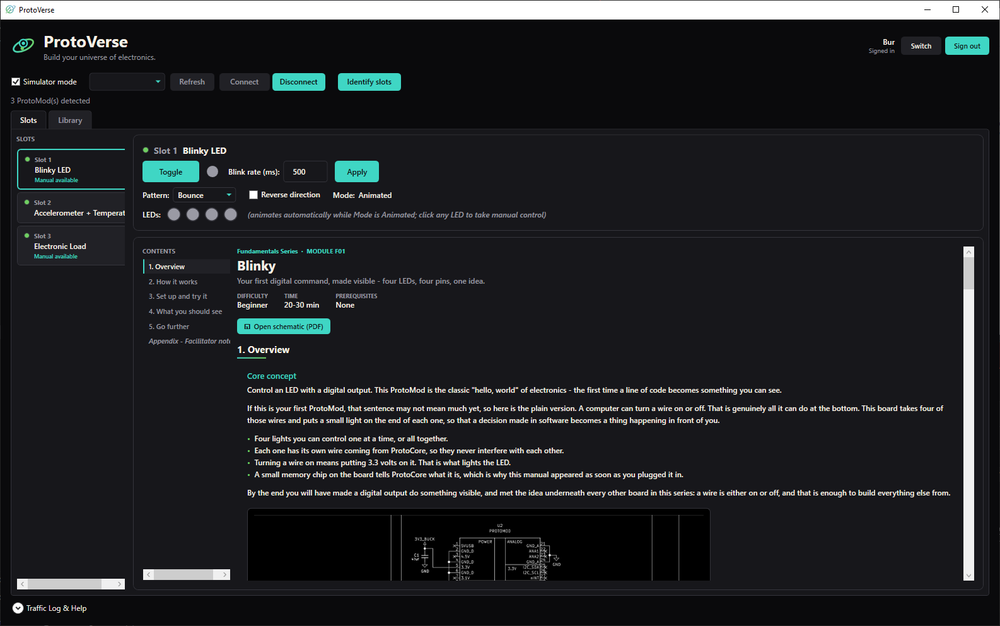

---

## Why it exists

ProtoVerse is a modular electronics education platform: a ProtoCore host board
plus interchangeable ProtoMods, each teaching one concept. The catalog is being
designed for **1,000+ eventual module types**, of which any one ProtoCore holds
three.

That number is the whole design constraint. An app that hardcodes its module
list is dead on arrival at that scale, so this one hardcodes nothing: it asks
the hardware what is present and builds the UI from the answer. Adding a module
to the app is one line in a registry plus its own panel — no changes to slot
logic, window layout, or anything else.

The second constraint is the audience. The person holding the board may never
have used a multimeter. So the app carries the teaching material too, next to
the live hardware, instead of leaving a PDF open in another window.

---

## What you get

### One window, whatever is plugged in

Connect and the app immediately asks ProtoCore what is in each slot. Every
populated slot becomes a real control panel — no configuration step, no module
picker. Pull a board mid-session and plug in a different one and the slot
re-resolves itself live, because ProtoCore volunteers a fresh report on
hot-swap rather than waiting to be asked.

The left rail is the slot navigator: three physical slots, a colour-coded
status dot each, and whether that board ships a manual. Selecting one opens its
workspace — controls on top, manual underneath.

### Lab manuals, inside the app, next to the hardware

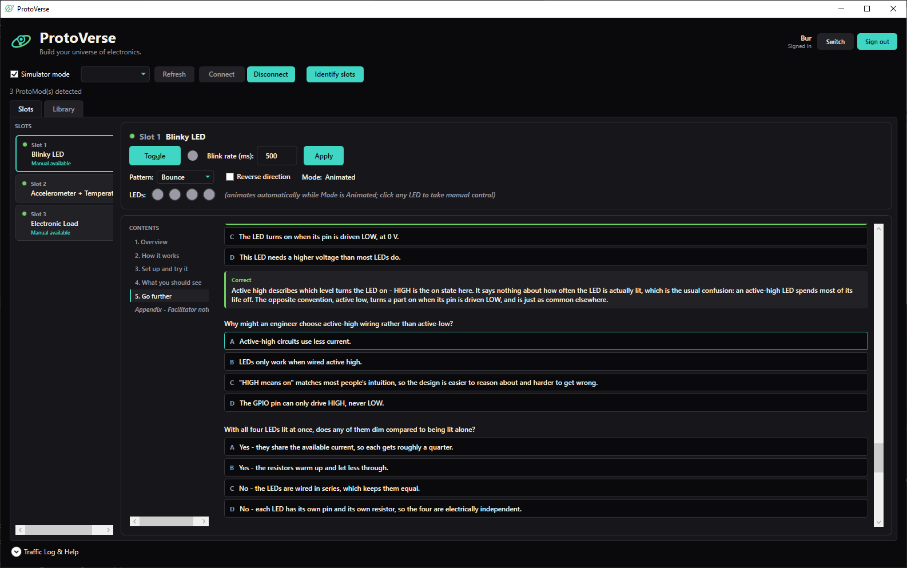

Manuals are rendered from a structured content model, not embedded PDFs — so
they are interactive where it matters:

- **Tickable steps** with inline `OBSERVE` prompts, so the learner reads the
  question at the moment it applies rather than in a block at the end.
- **Self-marking multiple choice.** Answering reveals the correct answer *and*
  the reasoning, in place. No answer key to leak, and no way to read the
  answers before committing to one.
- **A table of contents that tracks your scroll position**, so a learner
  mid-task can get back to a step without hunting.
- **The real schematic**, one click away — the complete KiCad-exported PDF,
  plus a monochrome circuit render inline in the overview.

Three manuals ship today: Blinky (F01), Simple LED (F02) and Electronic Load
(E05). They are deliberately pitched differently — F-series manuals assume the
reader has never met Ohm's law, E-series assume they own a multimeter.

### Deep enough for the hard boards

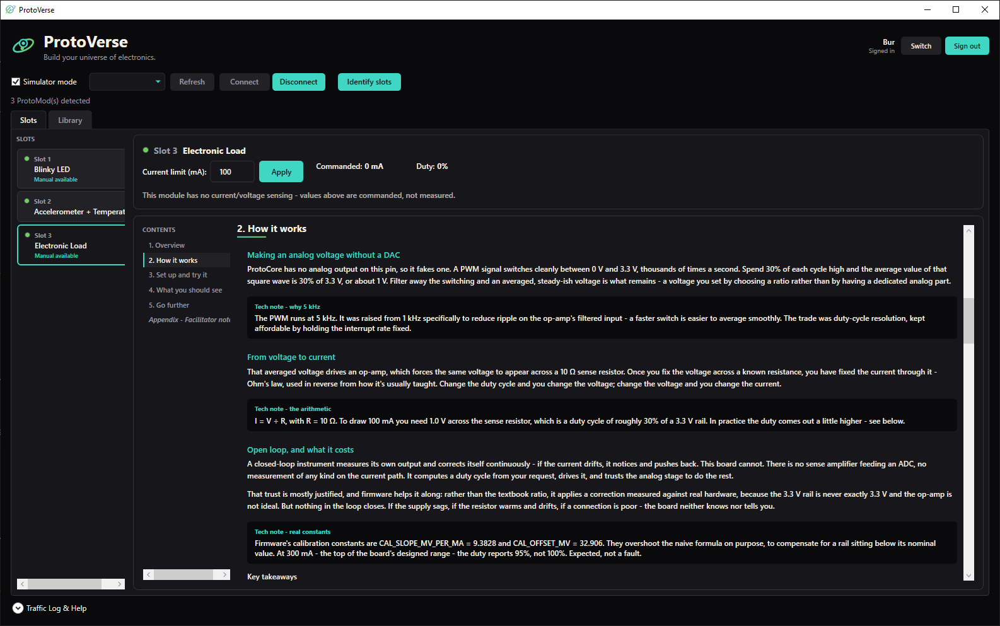

The Electronic Load manual teaches the thing that board is actually good for:
the difference between a value a machine was *told* and a value it *measured*.
That hardware is open-loop by design — a bit-banged PWM into an op-amp forcing
current through a sense resistor, with no ADC anywhere on the current path.

So the panel deliberately shows **no chart and no "measured" readouts**, and
says so on its face: *values above are commanded, not measured*. Fabricating a
plot from an echoed setpoint would have been easy and would have taught exactly
the wrong lesson.

### A catalog you can browse before you own it

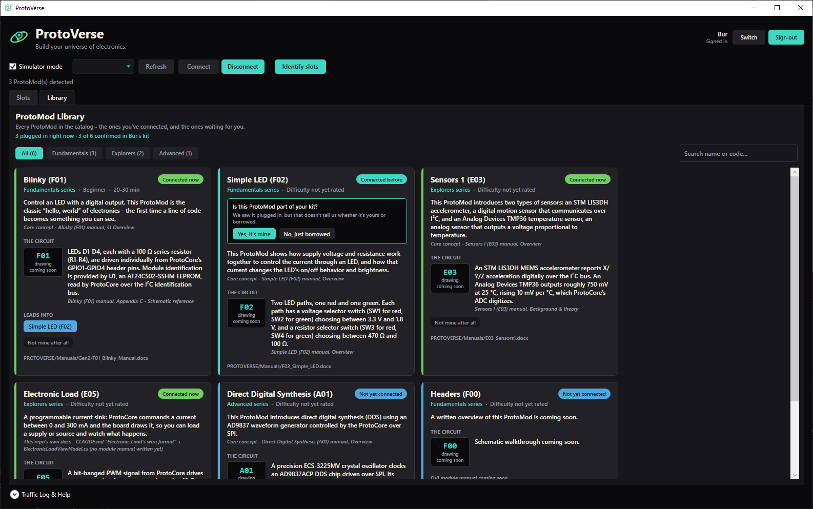

The **Library** tab shows the entire ProtoMod catalog — not just what is
plugged in. Filter by family (Fundamentals / Explorers / Advanced), search by
name or circuit code, and see every board at full strength. Nothing is dimmed,
locked, or hidden behind ownership.

Two facts are tracked per board, and the app is careful never to conflate them:

| Fact | How it is established |
|---|---|
| **Has it been plugged in?** | Observed automatically from `PresenceReport` |
| **Does the user say it is theirs?** | Only ever by clicking |

Seeing a board proves it was plugged in, not that anyone owns it — a borrowed
or classroom board is the obvious case. So a newly-seen card *asks*: "Is this
ProtoMod part of your kit?" Nothing is ever silently claimed on the user's
behalf.

Tracking is per profile, so two people sharing a PC do not merge kits. **These
profiles are not a security feature and are not meant to be** — no password, no
encryption, one readable JSON file. Their job is separating one person's
tracking from another's, not keeping anyone out.

**Every word on those cards is sourced.** Descriptions, schematic summaries and
project ideas are quoted from a document that actually exists, and each card
displays which one. Where no source material exists the field reads "coming
soon" rather than being filled with something plausible. ProtoVerse is physical
hardware sold to learners — an invented module description is a promise the
board cannot keep, and the customer is holding the board.

### Boards that are hands-on by design

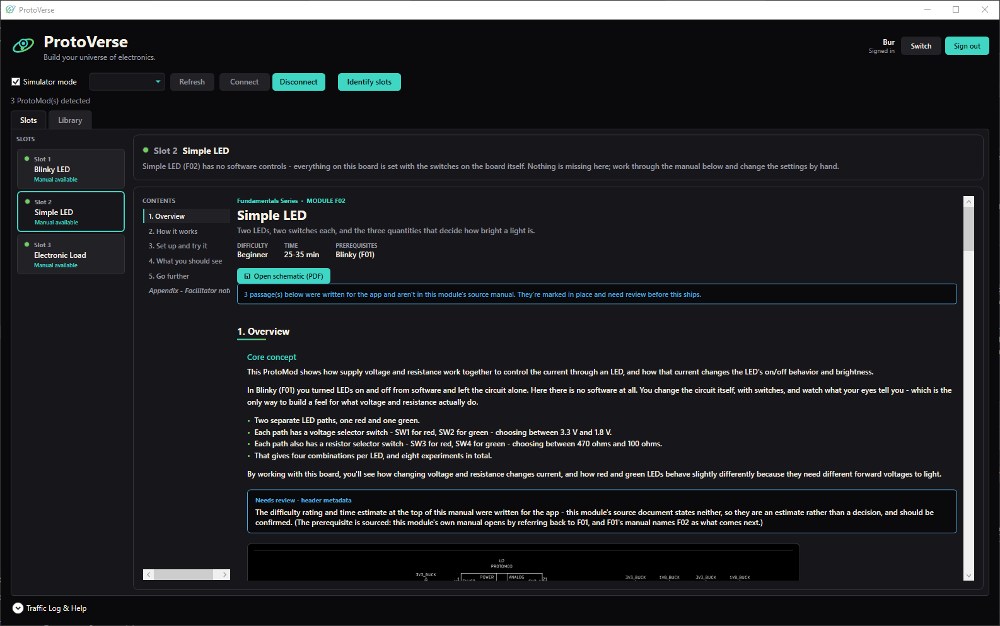

Some ProtoMods have no software controls at all — every input is a switch on
the board. Simple LED (F02) is the first.

These get a green dot and a note pointing at the board's own switches, **not**
the orange "unsupported" treatment. The distinction is deliberate: *"no panel
because none is possible"* and *"no panel yet"* look identical from the code
that builds the slot, but they are opposite facts, and only one of them is a
gap to close. Telling a learner the app does not support their board, directly
above that board's manual, is a bad first impression of both.

The blue banner in that screenshot is a second honesty mechanism. F02's source
manual predates the current template, so some passages had to be written for
the app with no document behind them. Those are flagged in place and counted at
the top. Unsourced content that *looks* finished is more dangerous than content
that is obviously missing — the only way to catch it is to have it say so.

### Nothing hidden on the wire


Every frame sent and received is logged as **both** raw hex and a plain-English
decode — `SetCurrentLimitMa: 100 mA`, `Error: PROTOCOL_ERR_NOT_IMPLEMENTED
(0x04)`, `Slot 0: BlinkyLed, Slot 1: AccelTemp, Slot 2: ElectronicLoad`.
Framing errors, checksum failures and disconnects appear here too.

This is not a debug afterthought. It is the only thing in the system that can
distinguish three failure modes that otherwise look identical from the UI:

1. The app did nothing.
2. Firmware is alive and **rejecting** the frame (an `Error` response).
3. Firmware's main loop has **stopped** (silence, on an otherwise healthy link).

Case 3 is not hypothetical — the Traffic Log is what diagnosed a real firmware
freeze during development: an unbounded USB retry that could wedge ProtoCore's
entire superloop, found from a capture showing two clean exchanges followed by
total silence. See `CHANGELOG.md` entry 38.

### Works with no hardware at all

A **Simulator mode** checkbox swaps the real serial port for a fake ProtoCore
that reports modules, answers commands, and streams plausible telemetry. The
whole app — panels, manuals, Library, Traffic Log — is fully usable for
development, demos and curriculum work with nothing plugged in. Every
screenshot in this document was taken in Simulator mode.

---

## How it works

### System context

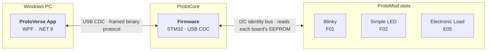

Each ProtoMod carries an EEPROM holding its circuit code. ProtoCore reads it
over I2C, maps it to a `ProtoModId`, and reports the result. **The app never
touches that bus** — it only ever receives the conclusion.

### Layers

`ISerialService` is the seam Simulator mode plugs into: `FrameDispatcher` talks
to the interface, never to `SerialService` directly, so the mock stands in
without either side knowing.

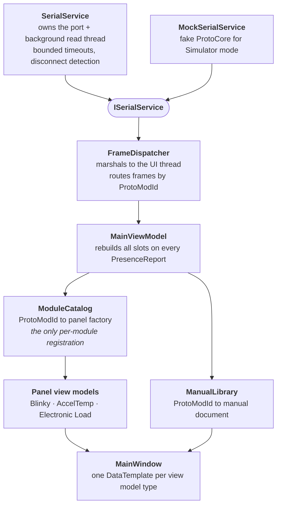

### Connect, identify, panels

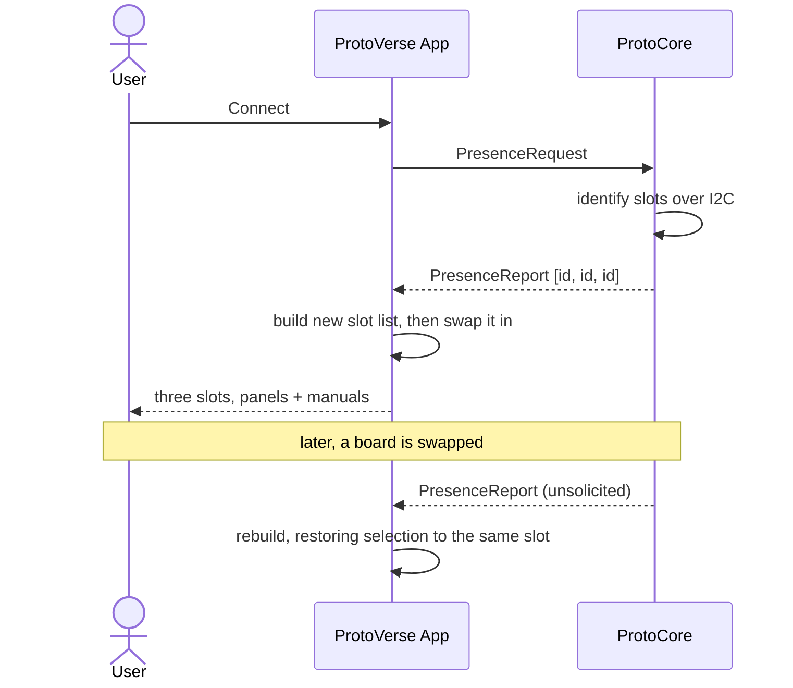

Identify runs automatically on connect — the boards are expected to just show
up. The list is **built fully, then swapped in**, so a failure while
constructing one panel can never disturb slots that are already working, and
each panel's construction is individually wrapped: one misbehaving module type
degrades its own slot and nothing else.

### How a slot becomes a panel

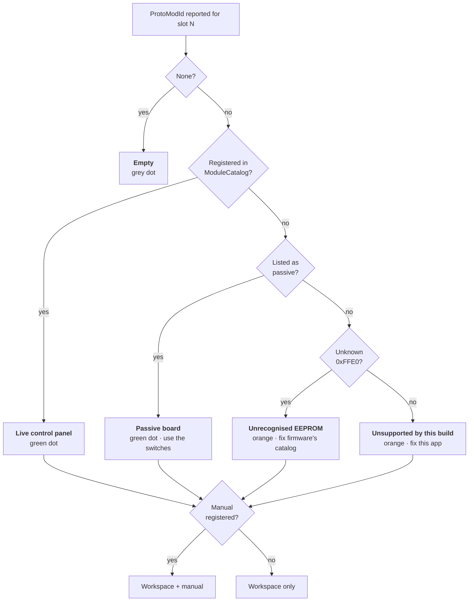

Those four non-empty outcomes are four genuinely different facts, and the UI
distinguishes all of them. Two are gaps to close — in *different* codebases.
One is finished by design. Collapsing any of them into "unsupported" is how you
spend an evening debugging the wrong repository.

### A command round trip

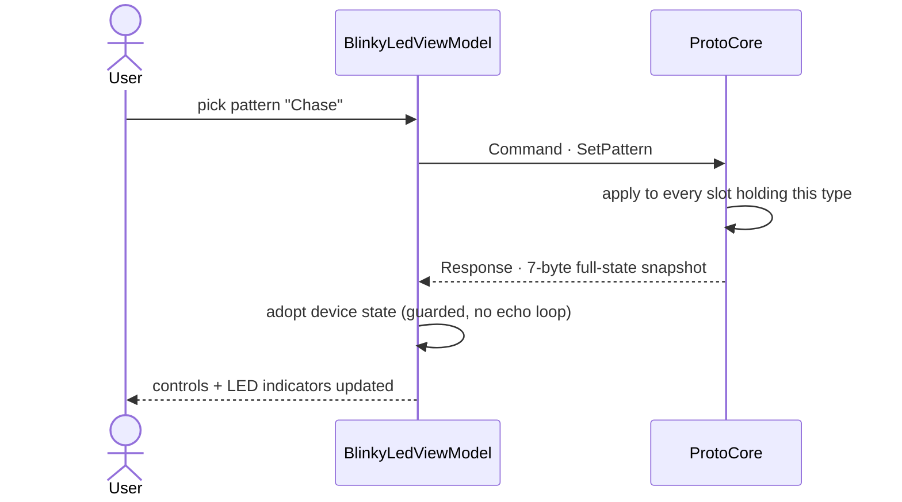

**Every property on a panel is populated only from the device's echoed
state** — never from local optimism. Click a control and nothing moves until
the hardware confirms it. Blinky's four LED indicators are then animated by a
local timer that reconstructs the pattern between snapshots, since the protocol
reports state changes rather than one frame per animation step. That
reconstruction is an exact match for firmware's real sequences, and the app
says plainly that it is a re-creation rather than telemetry.

---

## Wire protocol (v1, `Models/ProtocolFrame.cs`)

```
+-------+------------+------------+---------+--------+-----------+----------+-------+
|  STX  | ProtoModId | ProtoModId | MsgType | Length |  Payload  | Checksum |  ETX  |
| 0x02  |     lo     |     hi     |         |        |  0-250 B  |   XOR    | 0x03  |
+-------+------------+------------+---------+--------+-----------+----------+-------+
```

- **ProtoModId** — 2 bytes, little-endian, sized for a catalog expected to pass
  1,000 types. Reserved IDs live at the top of the range so they read as system
  addresses: `0xFFE0` Unknown, `0xFFF0` Core, `0xFFFF` Broadcast. A new module
  means a new ID here *and* in firmware, together.
- **MsgType** — Command, Response, PresenceRequest, PresenceReport, StreamData,
  Error.
- **Checksum** — XOR over both ID bytes, MsgType, Length and every payload
  byte. No CRC and no byte-stuffing yet: a known, accepted gap at this scale,
  worth revisiting before wider deployment.
- **Error codes** (`payload[0]` of an `Error` frame) — `0x01` NotPresent,
  `0x02` UnknownMsgType, `0x03` BadPayloadLength, `0x04` NotImplemented,
  `0x05` BadValue.

`ProtocolFrameReader` reconstructs frames incrementally from the byte stream
with resync-on-error — a bad checksum, bad ETX or oversized Length drops back
to scanning for STX. It never assumes a whole frame arrives in one read,
because it usually does not.

### Presence reports are fixed-size, and that matters

`PresenceReport`'s payload is **exactly one `ProtoModId` per physical slot,
always in slot order** — an empty slot reports `None` rather than being
omitted.

This replaced a variable-length "only the occupied slots" format after it
caused a real bug: with one board installed, "module in slot 0" and "module in
slot 1, others empty" produced byte-identical payloads, so a board in any slot
but the first always rendered in the first panel. Anything that is not exactly
`SlotCount x 2` bytes is now rejected outright rather than partially
interpreted.

---

## Adding a new ProtoMod

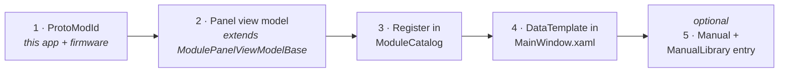

Nothing in `MainViewModel`, the slot-population logic, or the window layout
changes. Until step 3 is done, a board reporting that ID degrades to an
"unsupported" placeholder — intentional, since there will always be more
cataloged ProtoMod types than any single build ships panels for.

A board with **no** software controls skips steps 2 to 4 entirely and is listed
as passive instead.

---

## Building and running

Requires the .NET 8 SDK and the ".NET desktop development" workload.

```
dotnet build ProtoVerseApp.sln
dotnet run --project ProtoVerseApp/ProtoVerseApp.csproj
```

No hardware needed — tick **Simulator mode**, then **Connect**.

`tools/build_schematics.ps1` regenerates the bundled schematic assets from the
KiCad sources (requires KiCad 9 and Microsoft Edge, which rasterises the SVG).

---

## Status: what is proven, and what is not

This project distinguishes *compiles*, *works in the simulator*, and *confirmed
against real hardware*, and does not round one up to another.

| Area | Status |
|---|---|
| **Blinky LED (F01)** | Confirmed on hardware. Real commands, device-echoed state, no placeholders. |
| **Electronic Load (E05)** | Wire format settled and confirmed on hardware across a full 1-300 mA sweep. |
| **Simple LED (F02)** | Passive board; identity confirmed. No commands exist to verify. |
| **Accel + Temp (E03)** | UI complete — temperature trend, X/Y tilt plot, Z fill gauge — but the payload layout is an explicit placeholder pending firmware defining the real command set. |
| **Presence + hot-swap** | Confirmed on hardware. Fault isolation additionally verified by deliberate fault injection. |
| **Disconnect on cable pull** | Handled and regression-tested, but never reproduced against a genuinely hung OS handle. |
| **In-app manuals** | Rendering verified end to end. Manual *content* is sourced from real documents; anything unsourced is flagged in-app. |
| **E05 rejecting >300 mA** | **Disputed.** Documentation says it is rejected; a bench report says 400 mA is accepted; firmware source review says otherwise again. Unresolved, and deliberately not papered over. |

---

## More detail

| File | What is in it |
|---|---|
| `CLAUDE.md` | The living state of the project — what is settled, what is provisional, decisions already made, and gotchas already paid for. |
| `CHANGELOG.md` | Every change, dated, with the prompt that drove it and why. |
| `EVALUATION.md` | The in-app manuals spike: recommendation, effort estimate, and the findings that changed it. |
