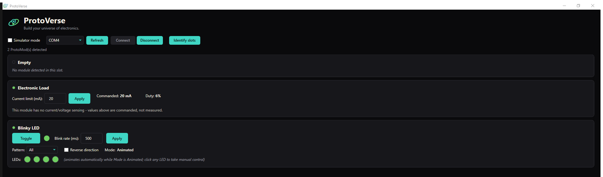
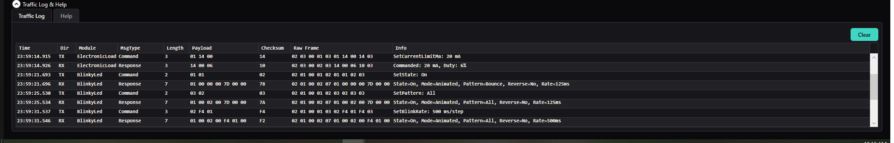

# ProtoVerse PC App

A Windows desktop app (WPF, .NET 8) that talks to a ProtoCore board over USB
serial and gives you a live control panel for whichever ProtoMods are plugged
into it — no serial terminal, no hand-decoding hex, no code required to use it.



## What it does

- **Auto-detects what's plugged in.** Connect, and every populated slot turns
  into a real control panel automatically — no manual configuration.
- **Live control, not just monitoring.** Blinky LED's four LEDs, animation
  pattern, direction, and rate are all controllable from the UI and reflect
  the device's actual state (not a locally-guessed one).
- **Hot-swap safe.** Pull a ProtoMod and plug in a different one while
  connected — the slot updates itself, and one misbehaving module can't take
  down the rest of the app.
- **Works with zero hardware.** A "Simulator mode" checkbox swaps in a fake
  ProtoCore that reports modules and streams plausible telemetry, so the app
  is fully usable for development, demos, or curriculum work without a board
  on hand.
- **Explains itself when something goes wrong.** The Traffic Log records
  every frame sent and received, decoded into plain English — this is what
  actually diagnosed a real firmware freeze bug during development (see
  `CHANGELOG.md` entry 38 for the full story).



## Module support status

| ProtoMod | Status |
|---|---|
| **Blinky LED** | Fully implemented — real commands, real device-echoed state, no placeholders. |
| **Electronic Load** | Wire format finalized and confirmed against real hardware. No live chart by design — this board has no ADC feedback, so there's nothing measured to plot, only the commanded current and PWM duty it echoes back. |
| **Accelerometer + Temperature** | UI is complete (live charts: temperature trend, an X/Y tilt "bubble level," a Z fill gauge), but the wire payload is still a placeholder pending firmware defining this sensor's real command set. |
| **Basic LED**, others | Identified by firmware but not yet given a panel in this app — shown as an "Unsupported module" placeholder rather than crashing or being hidden. |

See `CLAUDE.md` for the full, currently-accurate story on what's real vs.
provisional, and `CHANGELOG.md` for the chronological history of how it got
there.

## Building and running

Requires the .NET 8 SDK and the ".NET desktop development" workload (Visual
Studio 2022, or `dotnet` from the command line). From the repo root:

```
dotnet build ProtoVerseApp.sln
dotnet run --project ProtoVerseApp/ProtoVerseApp.csproj
```

No hardware needed to try it — check **Simulator mode** in the top bar, then
**Connect**.

## Architecture

```
Serial port (one connection)
  -> SerialService        (owns the port + background read thread — nothing else touches it)
  -> FrameDispatcher       (marshals to the UI thread, routes by ProtoModId, exposes Send/RequestPresence)
  -> ModuleCatalog         (ProtoModId -> panel view model factory - the only place new ProtoMod types get registered)
  -> Panel view models     (built dynamically from PresenceReport, one per detected ProtoMod - each filters for its own ProtoModId)
  -> MainWindow            (ItemsControl bound to the slot collection, one DataTemplate per view model type)
```

`ISerialService` is the seam Simulator mode plugs into — `FrameDispatcher`
talks to the interface, not `SerialService` directly, so `MockSerialService`
can stand in without either side knowing the difference.

## Wire protocol (v1, defined in `Models/ProtocolFrame.cs`)

```
[STX 0x02] [ProtoModId_lo] [ProtoModId_hi] [MsgType] [Length] [Payload...] [Checksum] [ETX 0x03]
```

- **ProtoModId** (`Models/ProtoModId.cs`) — 2 bytes, little-endian, sized for
  a catalog expected to eventually exceed 1,000 ProtoMod types. Fixed
  vocabulary shared with firmware: `0x0001` BlinkyLed, `0x0002` AccelTemp,
  `0x0003` ElectronicLoad, `0x0004` BasicLed, `0xFFE0` Unknown (a slot with a
  valid but uncataloged EEPROM read — distinct from an empty slot), `0xFFF0`
  Core (ProtoCore itself), `0xFFFF` Broadcast (reserved). Add new IDs here
  *and* in firmware together whenever a new ProtoMod type is introduced.
- **MsgType** (`Models/MsgType.cs`) — Command, Response, PresenceRequest,
  PresenceReport, StreamData, Error.
- **Checksum** — XOR of both ProtoModId bytes, MsgType, Length, and every
  payload byte. No CRC, no byte-stuffing/escaping yet — a known, accepted gap
  at the current scale, worth revisiting before wider deployment.
- **Max payload** — 250 bytes per frame. Anything bigger (bulk waveform data)
  should be split across multiple `StreamData` frames rather than growing
  this.
- **Error codes** (payload[0] of an `Error` frame, confirmed against
  firmware's `protocol.h`) — `0x01` NotPresent, `0x02` UnknownMsgType, `0x03`
  BadPayloadLength, `0x04` NotImplemented, `0x05` BadValue.

`ProtocolFrameReader` in the same file is a small state machine that
reconstructs frames from a raw byte stream incrementally, with resync-on-error
(a bad checksum/ETX/oversized Length drops back to scanning for STX) — it
doesn't assume a whole frame arrives in one serial read, since it usually
won't.

### Presence detection

`PresenceRequest`/`PresenceReport` are addressed to `Core`. The report's
payload is a **fixed-size** array — exactly one `ProtoModId` per physical
slot, always in slot order, 2 bytes little-endian each — not a variable-length
list of only the occupied slots; an empty slot reports `ProtoModId.None`
rather than being omitted. (This replaced an earlier skip-empty-slots format
after it caused a real bug: with only one slot occupied, "module in slot 0"
and "module in slot 1" produced an identical single-entry payload.)
`MainViewModel.OnFrameReceived` rebuilds all slots from that fixed list on
every report — sent in reply to a request, and also unsolicited if ProtoCore
detects a hot-swap on its own, so slots update live without needing another
click.

## Diagnosing a real hardware problem

The Traffic Log (collapsed by default, bottom of the window) is the first
stop when something doesn't behave as expected against real hardware. Every
frame sent and received is shown both as raw hex (nothing hidden) and as a
plain-English decode via `Models/FrameInterpreter.cs` — e.g.
`SetCurrentLimitMa: 100 mA` or `Error: PROTOCOL_ERR_NOT_IMPLEMENTED (0x04)`
instead of a hex blob you'd have to decode by hand. Framing/checksum errors
and disconnect events show up here too, capped at the last 500 entries.

## Adding a new ProtoMod's panel

Because panels are built dynamically from `PresenceReport`, supporting a new
ProtoMod type never touches `MainViewModel` or the slot-population logic:

1. Add the `ProtoModId` (`Models/ProtoModId.cs`) and, in firmware, the
   matching ID.
2. Write the panel view model (extend `ModulePanelViewModelBase`) and its
   view.
3. Register `ProtoModId -> factory` in `ViewModels/ModuleCatalog.cs`.
4. Add a `DataTemplate` for the new view model type in `MainWindow.xaml`.

Until step 3 is done for a given ID, a module reporting that ID shows up as
an "Unsupported module" placeholder instead of a real panel — intentional
degradation, not a bug, since there will always be more cataloged ProtoMod
types than any single app build has panels for.

## More detail

- `CLAUDE.md` — the current, living state of the project: what's settled,
  what's still provisional, gotchas already hit, and platform decisions
  already made.
- `CHANGELOG.md` — a chronological, dated log of every change and why it was
  made.
